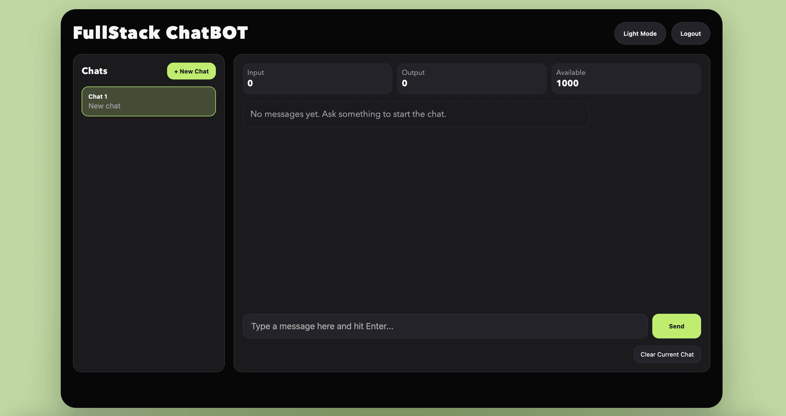

# FullStack AI Chatbot

Full-stack chatbot app with:
- React + Vite frontend
- Express + PostgreSQL backend
- JWT authentication
- Token usage tracking per user
- Light/Dark theme toggle UI
- Persistent chat sessions/messages in PostgreSQL
- Streaming assistant responses
- Conversation rename/archive/delete
- PDF/Image attachments in prompts

## Home Screenshot

Add your screenshot at `docs/images/home.png`, then it will render here:



## Features

- User registration and login
- Protected chat endpoint with JWT auth
- Multi-chat session UI
- Token usage display (input/output/available)
- Responsive interface for desktop/mobile
- Theme switcher (dark/light)

## Project Structure

- `frontend/` React app
- `backend/` Express API + DB access
- `backend/schema.sql` users table schema
- `backend/.env.example` backend environment template

## Prerequisites

- Node.js 18+
- npm
- PostgreSQL 14+

## Backend Setup

```bash
cd backend
npm install
cp .env.example .env
```

Update `backend/.env`:

```env
PORT=8080
DB_USER=admin
DB_HOST=localhost
DB_NAME=chatbot_db
DB_PASSWORD=change_me
DB_PORT=5432
JWT_SECRET=change_me_to_a_long_random_secret
ANTHROPIC_API_KEY=
ANTHROPIC_MODEL=claude-3-haiku-20240307
TOKEN_LIMIT=1000
```

Create database/table:

```bash
PGPASSWORD=change_me psql -h localhost -U admin -d chatbot_db -f schema.sql
```

Run backend:

```bash
npm run server
```

## Frontend Setup

```bash
cd frontend
npm install
npm run dev
```

Optional frontend API override:

```env
VITE_API_BASE_URL=http://localhost:8080/api
```

Backend now auto-runs `backend/schema.sql` on startup, so required tables are created if missing.

## Tests

Backend:

```bash
cd backend
npm test
```

Frontend:

```bash
cd frontend
npm test
```

## Recent Changes

- Removed hardcoded backend secrets/config and moved to env variables
- Added `.env.example` for backend config
- Improved backend route validation and error responses
- Added fallback response mode when Anthropic key is not set
- Refactored frontend auth/session flow
- Redesigned UI and added dark/light mode toggle
- Updated chat bubble alignment (user right, bot left)
- Added better `.gitignore` coverage for env and generated files
- Added DB-backed chat persistence (sessions/messages)
- Added streaming chat endpoint and incremental UI rendering
- Added conversation rename/archive/delete controls
- Added PDF/image upload + attachment-aware prompts
